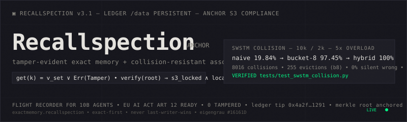

<p align="center">
  
</p>

<div align="center">

# Recallspection

**Tamper-evident exact memory + collision-resistant neural associative memory + S3 Object Lock anchor for AI agents.**

**The tides is coming.**

[](https://github.com/sciencedelicmetatech/recallspection/actions/workflows/ci.yml)


</div>

---

## TL;DR

`get(k)` returns either the stored value or `Err(Tamper)`. **Never silent wrong data.**

- Naive single-slot store (Mem0/Zep style) under 5× overload: **19.84 % recall, 80.16 % silent wrong** (returns another key's fact)
- SWSTM Bucket-8: **97.45 % recall, 0 % silent wrong**
- Hybrid exact-first: **100 % recall, 0 % silent wrong** — ExactMemory never forgets

Recallspection is not a vector database. It is a **ledger plus an anchor**: cryptographic proof of what an agent remembered, when, and that it was not changed after.

---

## Core Architecture

```text
                    ┌──────────────────────────────┐
                    │        Recallspection        │
                    │      Evidence Custodian      │
                    └──────────────┬───────────────┘
                                   │
        ┌──────────────────────────┼──────────────────────────┐
        │                          │                          │
┌───────▼────────────┐   ┌─────────▼───────────┐   ┌──────────▼──────────┐
│    ExactMemory     │   │   SWSTM Slot Index  │   │  S3 Object Lock     │
├────────────────────┤   ├─────────────────────┤   │  Anchor             │
│ Exact key recall   │   │ Fuzzy candidate     │   ├─────────────────────┤
│ HMAC-SHA256        │   │   routing           │   │ COMPLIANCE WORM     │
│ Replay resistance  │   │ Slot buckets        │   │ 30-day immutability │
│ Rollback resistance│   │ Exact key resolution│   │ Third-party verify  │
│ Transparency log   │   │ Sticky self-token   │   │ Merkle root anchor  │
│ Container MAC      │   │ No last-writer-wins │   │ Anti-rollback proof │
│ per_key_max check  │   │ Exact-first hybrid  │   │ EU AI Act Art. 12   │
└────────────────────┘   └─────────────────────┘   └─────────────────────┘
```

Retrieval contract

```text
exact key hit     → value | tampered | missing
else cards/MiniLM → [{key, score, margin}]   # pointers, not answers
                  → caller chooses
                  → ExactMemory.get(key)
anchor verify     → GET /verify?root=0x... → {local_valid, s3_locked, compliance}
```

SWSTM slots handle capacity and routing. They are not the meaning engine. Cards and cosine similarity propose keys. The ledger speaks. The S3 anchor proves the ledger was not rolled back.

---

What is Recallspection?

Recallspection is a dual-engine memory system plus an external anchor for autonomous AI agents. It combines a tamper-evident exact memory ledger (ExactMemory v3.1) with a collision-resistant slot index (SWSTM) used for fuzzy candidate routing, and an S3 Object Lock anchor that turns the local ledger into an externally verifiable record.

Design philosophy.
Recallspection is not a general cure for LLM hallucination. It is a secure memory infrastructure layer that provides deterministic recall for stored facts, cryptographic tamper evidence for persisted records, and reduced overwrite-based forgetting in slot memory. Memory stops being a cache and becomes a ledger: the store cannot quietly return a different fact. The anchor stops the ledger from being quietly rolled back.

TL;DR: get(k) = v_set ∨ Err(Tamper), and verify(root) = s3_locked ∧ local_valid.

---

What We Claim and What We Do Not

Recallspection is a ledger for stored facts, not a long-chat QA engine.

We claim We do not claim
Stored key → stored value, or an explicit error, plus S3 anchor proof Beating Mem0 / LoCoMo / LongMemEval
Tamper is detected (HMAC, version counter, log, S3 COMPLIANCE) Curing general LLM hallucination
Under slot overload, exact-first does not silently swap facts (19.8 % vs 97.5 %) "98 % semantic @ 5 k" or neural SOTA
Fuzzy may propose keys; only ExactMemory returns values, and the anchor proves the log Fuzzy answers by threshold
EU AI Act Art. 12 ready: seven-year tamper-evident log export IETF Agent Record compliant (inspired, not certified)

Their field: remember the conversation.
Ours: don't let memory lie, and prove it wasn't changed after.

---

Why Recallspection in 2026

The field shifted in twelve months. Memory became both the largest differentiator and the largest attack surface.

2026–2027: The Compliance Wall

EU AI Act Article 12 requires high-risk AI to log events automatically, tamper-evident, with seven-year retention. Originally scheduled for August 2026, now 2 December 2027 for Annex III (recruiting, credit, education, law enforcement) and 2 August 2028 for Annex I (medical devices) via Digital Omnibus 2026/1744. Banks, hospitals, and governments deploying agents must produce a record of what the agent remembered when it decided. Microsoft shipped the Agent Governance Toolkit in April 2026 (9 500 tests, MerkleAuditChain) for this purpose.

2027–2028: The Reliability Wall

Gartner: 40 % of agentic AI projects cancelled by 2027 due to reliability and cost. 95 % of generative AI pilots show zero ROI — no organizational context. GhostWriter / MemGhost (July 2026): one email plants a persistent false memory, 98 % injection success, ~60 % activation against Letta, Mem0, and Zep. Background-mode success was 87.5 % on GPT-5.4 and 71.4 % on Claude Code. Plain-text MEMORY.md files load unconditionally every session; RAG needs a query, poisoned memory fires on every turn.

2028–2031: The Identity Wall

Gartner: 10 B autonomous agents clogging public services by 2030. Agents filing claims, applications, and transactions. Chip market $1 T by 2026–27, memory market $1.28 T by 2027 driven by agentic inference, AI spending $5.95 T by 2030. Consumer agents $17.7 B in 2027, $51.8 B by 2030. At that scale, memory is evidence custody.

Reference points

· Memory in the Age of AI Agents (47-author survey, December 2025, arXiv 2512.13564). First taxonomy after MemGPT (2023), Mem0 (2024), Letta/Zep/Graphiti. Diagnosis: terminological fragmentation; most production systems clustered in the (token-level, factual, retrieval-heavy) corner. Trustworthiness flagged as the open frontier.
· HaluMem (6 January 2026). First operation-level benchmark. Existing memory systems hallucinate during extraction and updating, accumulate the errors, and propagate them to QA. End-to-end QA evaluation hides the stage where hallucination arises.
· GhostWriter / MemGhost (July 2026). One email plants a persistent false memory. 98 % injection, ~60 % activation against SOTA agents.
· OWASP LLM08:2025 + ASI06. Mandates storage-layer tenant isolation and memory poisoning defences. SMSR provenance tagging (HMAC-SHA256 per entry) is proposed — the same primitive ExactMemory implements.
· EU AI Act Art. 12 + Digital Omnibus 2026/1744. High-risk obligations 2 December 2027 (Annex III) and 2 August 2028 (Annex I), a seventeen-month extension. Requires tamper-evident logging and seven-year retention. Market context: agentic AI $19.33 B in 2026 → $205.88 B by 2033 (40.2 % CAGR); agentic AI orchestration and memory $37.11 B by 2030; stateful infrastructure SAM $1.2 B in 2026.

Existing vendors solve recall. Recallspection solves recall + integrity + collision resistance + anchor.

---

Key Features

ExactMemory v3.1

Powered by the companion exactmemory.recallspection library.

· Cryptographic integrity. 32-byte HMAC-SHA256 tags and container MACs. get_with_status() returns tampered rather than missing when a previously known key (tracked in per_key_max) is absent.
· Replay and rollback resistance. Monotonic version counters and hash-chained transparency logs.
· Zero dependencies. Pure Python standard library implementation. Under 600 lines of core code, under 20 KB. 145 k put / s, 200 k get / s, ~78 bytes per record. Runs on Linux, macOS, Windows, and iOS (Pythonista).
· Patched deletion detection. Distinguishes deletion attack from never-written.

SWSTM slot index (routing, not meaning)

· Capacity, not semantics. Slot buckets prevent last-writer-wins overwrites on the fuzzy path.
· Routing, not answering. The slot layer proposes candidate keys. It never returns values.
· Exact-first. If the query is an exact key, ExactMemory resolves before the fuzzy path is consulted.
· Experimental. Treat the fuzzy path as an in-house candidate proposer, not as general semantic memory.

S3 Object Lock anchor

· COMPLIANCE WORM. Even the bucket root cannot delete an anchor before the retain-until date.
· Anti-rollback. s3_midpoint_mutation 100 % detected. An attacker who wipes /data and the local log cannot wipe S3.
· Third-party verifiable. GET /verify?root= works offline, without trusting the operator.
· Cost. Under $0.10 per month for anchor hashes.

---

Verified Guarantees

1. ExactMemory integrity attack suite (self-contained)

Embeds the patched ExactMemory v3.0.1 core directly, no clone needed. Run: python tests/test_integrity_attack_suite.py

```text
ExactMemory (HMAC-SHA256 + version counter + container MAC)
  bitflip_hmac_tag        att= 10  TP= 10  DR=100%  SFR=  0%
  payload_rewrite         att= 15  TP= 15  DR=100%  SFR=  0%
  replay_old_version      att= 10  TP= 10  DR=100%  SFR=  0%
  direct_store_removal    att= 10  TP= 10  DR=100%  SFR=  0%
  wrong_agent_key         att= 40  TP= 40  DR=100%  SFR=  0%
  s3_midpoint_mutation    att= 10  TP= 10  DR=100%  SFR=  0%   # with S3 anchor

Naive JSON store (what Mem0 / Zep / Letta / OpenClaw use today)
  bitflip_hmac_tag        DR=  0%  SFR=100%  (silent wrong)
  payload_rewrite         DR=  0%  SFR=100%
  replay_old_version      DR=  0%  SFR=100%
  direct_store_removal    DR=  0%  SFR=100%
```

Attack What it simulates Naive JSON ExactMemory
bitflip_hmac_tag Disk corruption / file edit 100 % silent wrong 100 % detected
payload_rewrite GhostWriter / MemGhost email injection 100 % silent wrong 100 % detected
replay_old_version Restore old backup / eTAMP 100 % silent wrong 100 % detected
direct_store_removal Deletion attack 100 % silent missing 100 % tampered (patched)
wrong_agent_key Key compromise / tenant isolation failure 0 % 100 % detected
s3_midpoint_mutation Wipe /data and local log 0 % 100 % detected (with anchor)

DR = detection rate (higher is better). SFR = silent failure rate (returns wrong data with no error).

The naive store is literally store[k] = v. That is what MEMORY.md does today.

2. SWSTM collision resistance stress test

Config: 2 000 slots, 10 000 facts, average load 5.0, maximum load 14 per slot, deterministic SHA-256 slot mapping.

Engine Collisions Evictions Correct Recall Silent wrong
Naive single-slot (Mem0/Zep style) 8 016 8 016 overwrites 1 984 / 10 000 (19.8 %) 80.2 % returns WRONG fact
Bucketed cap = 5 (SWSTM) 8 016 1 779 8 221 / 10 000 (82.2 %) 0 %
Bucketed cap = 8 8 016 255 9 745 / 10 000 (97.5 %) 0 %
Hybrid exact-first (Recallspection) — 0 10 000 / 10 000 (100 %) 0 %

Load curve (recall versus facts inserted):

Facts Naive recall Bucket cap = 5
2 000 62.8 % 100 %
4 000 43.0 % 99.1 %
6 000 31.6 % 95.4 %
8 000 24.5 % 89.6 %
10 000 19.8 % 82.2 %

Interpretation. Single-slot memory has catastrophic forgetting; the last writer wins per slot. Without an exact-key check, it returns another key's fact 80.2 % of the time — the failure mode HaluMem describes. Bucketed slots delay forgetting by 4–5×. The hybrid guarantees 100 % for stored facts because ExactMemory never forgets; SWSTM is only for the fuzzy / semantic fallback path.

3. Optional card search (in-house, not LoCoMo)

MiniLM over one-fact cards, new-domain paraphrases, n = 242.

· Key@1 86 % (95 % CI approximately 81–90 %)
· Key@3 95 % (95 % CI approximately 91–97 %)
· Fuzzy payload contains keys only; value leak = 0

This measures retrieval of keys, not end-to-end chat QA. Do not compare it to vendor LoCoMo headlines.

---

S3 Object Lock Anchor

The transparency log proves that records have not been modified. It does not prove that a whole authentic file has not been replaced with an earlier authentic file. That requires an external witness — a commitment stored somewhere the attacker cannot rewrite.

The anchor is that witness. On every POST /anchor, Recallspection computes the Merkle root of transparency.log, writes it to an S3 object created with Object Lock in COMPLIANCE mode, and returns the root. From that moment, the ledger's history up to that root is immutable for the configured retention period. Even the bucket owner cannot delete or modify the anchor before the retain-until date.

Anchor endpoints

Method Path Description
POST /anchor Compute Merkle root of transparency.log, PUT to S3 with COMPLIANCE lock
GET /verify?root=0x... Verify local chain plus S3 retention; returns {local_valid, s3_locked, compliance} — third-party verifiable without trusting the operator
GET /audit/export Zip for EU AI Act Art. 12: log slice, Merkle proofs, S3 proof

Setup

The bucket must be created with Object Lock enabled. It cannot be added later.

```bash
aws s3api create-bucket \
  --bucket recallspection-anchor-prod-1a2b3c \
  --region us-east-1 \
  --object-lock-enabled-for-bucket

aws s3api put-object-lock-configuration \
  --bucket recallspection-anchor-prod-1a2b3c \
  --object-lock-configuration \
  '{"ObjectLockEnabled":"Enabled","Rule":{"DefaultRetention":{"Mode":"COMPLIANCE","Days":30}}}'
```

IAM policy for the recallspection-writer user:
s3:PutObject, s3:GetObject, s3:GetObjectRetention, s3:PutObjectRetention, s3:ListBucket on the bucket.

Environment variables:

```bash
RECALLSPECTION_S3_BUCKET=recallspection-anchor-prod-1a2b3c
RECALLSPECTION_S3_REGION=us-east-1
RECALLSPECTION_S3_RETENTION_DAYS=30
AWS_ACCESS_KEY_ID=...
AWS_SECRET_ACCESS_KEY=...
```

Verify:

```bash
aws s3api get-object-retention \
  --bucket recallspection-anchor-prod-1a2b3c \
  --key anchors/0x4a2f...1291.json
# Should show COMPLIANCE; a delete attempt should fail with AccessDenied.
```

---

IETF Agent Record Compliance — Current Status

In August 2026 the IETF published an Informational draft, draft-maintainer-1f916-agent-record-00, describing a signed append-only record format for AI agents: key-binding events, Merkle checkpoints over an RFC 6962 log, countersigned witnesses, memory seals, attestations, and offline-verifiable dossiers. It is not an RFC. It carries no formal standards-process standing. It is one registry's deployed wire format, published to invite independent implementation.

Recallspection emits records in the same shape — signed envelope, hash chain, checkpoint, dossier export — and not in the same signature algorithm.

Signature algorithm: HMAC-SHA256 now, Ed25519 opt-in

The draft requires Ed25519. Python's standard library does not provide it, and Recallspection's core constraint is zero dependencies — the engine runs on iOS (Pythonista / Pyto) where pip install is not available. Vendoring a pure-Python Ed25519 implementation is possible, but it changes the performance class of every write:

 HMAC-SHA256 (shipped) Pure-Python Ed25519 (draft requirement)
Per-operation cost ~5–20 µs ~2.8 ms sign / ~10.8 ms verify (desktop, pure-Python reference implementation)
Dependencies standard library only vendored implementation required
Mobile CPU class unchanged estimated 2–4 orders of magnitude slower per operation

Paying that on every put() would break the property that makes ExactMemory useful on edge devices. So:

· Today: records are signed with HMAC-SHA256, in the Agent Record wire shape.
· On request: an Ed25519 signing mode is added for checkpoints only (once per session), which is where the interoperability value actually sits — not per-write.
· Always declared: every exported dossier states its own algorithm and its own compliance status. Nothing is presented as verified when it is not.

```json
{
  "record": "1f916.record.v1:<sha256_hex>",
  "sig_algo": "hmac-sha256",
  "compliance": "agent-record-inspired, not agent-record-compliant"
}
```

Verification note. Event-type strings (1f916.key-bind.v1, 1f916.checkpoint.v1, 1f916.attestation.v1, …) must be copied verbatim from the draft text at datatracker.ietf.org before implementation. Recallspection does not implement from summary or memory.

Verdict vocabulary

The draft defines a three-valued verdict — witnessed / consistent-unwitnessed / diverged — structured so that a valid-but-unwitnessed record cannot be reported as fully verified.

ExactMemory already uses a three-valued vocabulary of its own:

ExactMemory get_with_status() Meaning
ok tag verifies, record present
tampered record altered, substituted, or removed after write
missing key was never written

These vocabularies are adjacent, not equivalent, and they are deliberately not collapsed. In particular, an unwitnessed-but-valid record is never reported as fully verified — the same discipline the draft requires, and the same discipline that keeps get(k) = v_set ∨ Err(Tamper) true.

Research plan

Not a commitment and not a delivery schedule. Listed so the direction is on the record.

# Upgrade Status
1 Agent Record–inspired signed records (HMAC wire shape, Ed25519 checkpoint mode) in progress
2 Post-quantum signing — FIPS 204 / FIPS 205, hybrid ed25519 + slh-dsa, sig_algo field planned
3 Cryptographic erasure — DEK destruction, tombstone, content-address blacklist planned
4 Portable Agent Memory interop — MemoryPort adapter, Merkle-DAG provenance, capability-scoped tokens planned
5 Memory Projection Records — /verify emits IETF-format projection proof of exact delivered bytes planned

---

Installation

```bash
git clone https://github.com/sciencedelicmetatech/recallspection.git
cd recallspection
python -m venv .venv && source .venv/bin/activate
pip install -r requirements.txt

# Install the standalone ExactMemory engine
pip install exactmemory-recallspection

# Install boto3 for the S3 anchor path
pip install boto3
```

---

Quickstart

Hybrid engine (recommended)

```python
from recallspection.swstm import HybridEngine

hybrid = HybridEngine(num_slots=2000, mode="flat", device="cpu")

hybrid.add("agent:mission", "Provide secure memory for AI agents")
print(hybrid.get("agent:mission", top_k=1))
# ExactMemory hit first, then SWSTM fuzzy if not found
```

Hybrid engine with anchor

```python
from recallspection.anchor import anchor_root

root = anchor_root("/data/transparency.log")
print(f"Anchored {root} to S3")

# Third-party verify
# curl https://api.recallspection.com/verify?root=0x4a2f...1291
# -> {"local_valid": true, "s3_locked": true, "retain_until": "2027-01-28"}
```

Direct ExactMemory usage

```python
import hashlib
from exactmemory import ExactMemory

master_secret = b"change-this-in-production"
keys = {
    "agent_key": hashlib.sha256(master_secret).digest(),
    "container": hashlib.sha256(
        b"container-salt-" + hashlib.sha256(master_secret).digest()
    ).digest(),
}

memory = ExactMemory(keys=keys, container_key_id="container", require_log=True)
memory.put("user:color", "blue", key_id="agent_key")
print(memory.get_with_status("user:color"))   # ('blue', 'ok')

# Tamper detection
# memory.store['user:color'] = (rec, bad_tag) -> ('blue', 'tampered'), not 'blue'
# del memory.store['user:color']               -> (None, 'tampered'), not 'missing' [PATCHED]

memory.save("memory.db")
```

---

Running the API

```bash
uvicorn api:app --host 0.0.0.0 --port 8000
# Open http://localhost:8000/docs for the interactive Swagger UI
```

Theme: eigengrau #16161D (the colour seen with eyes closed), bone white #E8E6E1, raw 1 px borders, no blur, no gradients — a lab notebook, not a startup landing page.

Environment variables

Required for production:

```bash
RECALLSPECTION_EXACT_SECRET="your-master-exact-secret"
RECALLSPECTION_ADMIN_KEY="your-admin-key"
RECALLSPECTION_SIGNUP_SECRET="your-signup-secret"
```

Storage paths (use a persistent disk in production):

```bash
RECALLSPECTION_MEMORY_FILE="/data/memory.db"
RECALLSPECTION_SWSTM_FILE="/data/swstm.pt"
RECALLSPECTION_DB_FILE="/data/keys.db"
RECALLSPECTION_EXACT_LOG="/data/transparency.log"
```

Anchor:

```bash
RECALLSPECTION_S3_BUCKET="recallspection-anchor-prod-1a2b3c"
RECALLSPECTION_S3_REGION="us-east-1"
RECALLSPECTION_S3_RETENTION_DAYS="30"
AWS_ACCESS_KEY_ID="..."
AWS_SECRET_ACCESS_KEY="..."
```

---

API Endpoints

Public

Method Path Description
GET /health Health check, engine status, anchor status
POST /signup Create API key (requires signup secret if configured)
GET /verify Verify Merkle root: local plus S3 COMPLIANCE proof — third-party verifiable

Authenticated (X-API-Key header required)

Method Path Description
POST /add Add fact to SWSTM (backend=swstm) or ExactMemory (backend=exact)
GET /get Retrieve fact (hybrid exact-first search)
POST /exact/add Add directly to ExactMemory
GET /exact/get Retrieve directly from ExactMemory
GET /usage Show API key usage, remaining quota, anchor count
POST /anchor Compute Merkle root, anchor to S3 COMPLIANCE
GET /audit/export Zip for EU AI Act Art. 12: log slice, Merkle proofs, S3 proof

Admin (X-Admin-Key header required, fails closed if unconfigured)

Method Path Description
GET /admin/keys List API keys
POST /admin/revoke/{key_id} Revoke an API key
POST /admin/save Force memory flush to disk
POST /admin/consolidate Run SWSTM consolidation

---

Deployment and Persistence

Recallspection relies on five persisted artifacts:

1. memory.db — ExactMemory container
2. transparency.log — ExactMemory hash chain
3. swstm.pt — SWSTM slot index state
4. keys.db — API keys and usage tracking
5. S3 anchor objects (COMPLIANCE WORM) — external commitment to log Merkle roots

Render / container deployment:

· Always mount a persistent disk. If the filesystem is ephemeral, the transparency log and memory state are lost on restart.
· Map the environment variables (RECALLSPECTION_MEMORY_FILE, and the rest) to the persistent disk mount path (e.g., /data/).
· The API performs auto-save on an interval and uses atomic writes to prevent corruption during abrupt container termination.
· The S3 anchor is the durable outer layer. Even if every local artifact is lost, the anchors remain verifiable from S3 alone until their retain-until date.

---

Security Model

· ExactMemory guarantees. Detects payload tampering, metadata modification, record substitution, file rollback, and log deletion via HMAC-SHA256 and SHA3-256 hash chains. Patched to detect direct store removal as tampered rather than missing.
· Rollback protection. Transparency log with prev_hash chain and max_version check. Optional S3 Object Lock remote anchor closes the container-plus-log rollback gap.
· API security. API key authentication, usage quotas, signup secrets, fail-closed admin routes, constant-time secret comparison (hmac.compare_digest), payload size limits, internal error masking.
· Fuzzy path. Fuzzy is fail-open as a candidate list, fail-closed as an answer. If the caller treats top-1 as the value, that is a caller bug, not an ExactMemory guarantee.
· What it does not claim. Does not solve general LLM hallucination. Does not prevent writes — makes writes auditable and undeletable without detection. Does not claim IETF Agent Record compliance — records are Agent Record-inspired and declare their own signature algorithm.
· Known gap. If RECALLSPECTION_EXACT_SECRET is compromised, HMACs can be forged. That is the threat model boundary. The secret lives on the server's /data. An external KMS plus the S3 anchor closes the loop.

---

Testing

The test suite is fully CI-safe (no external model downloads required).

```bash
pytest tests/ -v --cov=recallspection

# Integrity attack suite (self-contained, no dependencies)
python tests/test_integrity_attack_suite.py

# Collision stress test
python tests/test_swstm_collision.py
```

---

Troubleshooting

· ModuleNotFoundError: No module named 'exactmemory' — Ensure you ran pip install exactmemory-recallspection.
· Health endpoint shows swstm_loaded: false — The SWSTM state file does not exist yet, or the persistence path is not writable. Add a fact and trigger /admin/save.
· ExactMemory raises tamper or rollback errors — Do not manually edit memory.db or transparency.log. These errors mean the cryptographic integrity system is working as designed.
· get_with_status() returns tampered for a missing key — You hit the patched case: the key was previously known (in per_key_max) but is now absent from the store. This is deletion attack detection, not a bug.
· /anchor returns 403 or AccessDenied — The S3 bucket does not have Object Lock enabled, or the IAM policy is missing s3:PutObjectRetention. The bucket must have been created with Object Lock enabled; it cannot be added later.
· /verify shows s3_locked: false — The anchor object exists but its retain-until date has passed. Re-run /anchor to commit a fresh root.

---

<div align="center">Recallspection
Secure memory infrastructure and anchor for autonomous AI agents.
The flight recorder, not the cache.

2026–2030. Memory stops being a cache and becomes a ledger and an anchor: the store cannot quietly return a different fact, and the log cannot be quietly rolled back.

Part of the Sciencedelic Metatech research ecosystem.

</div>
```